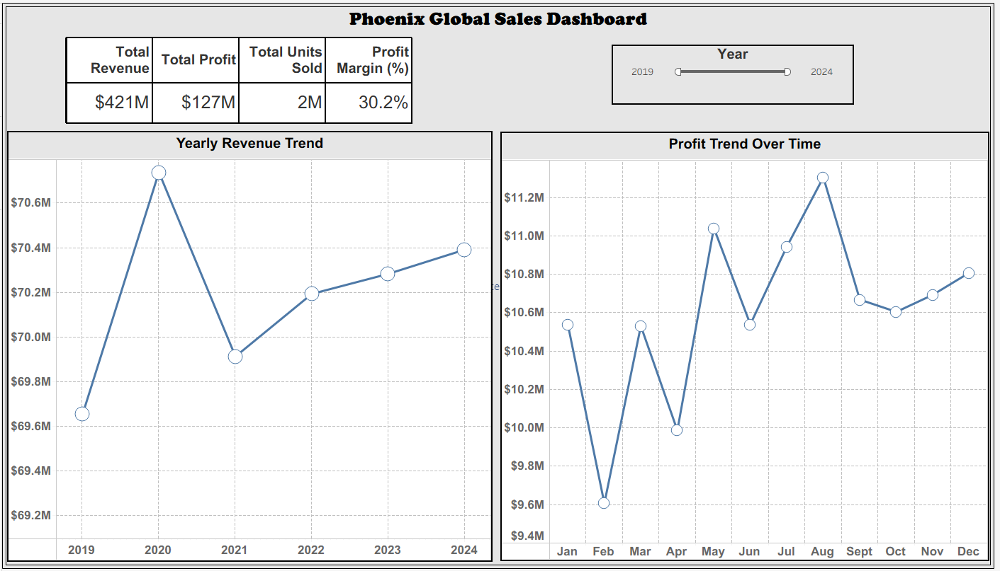
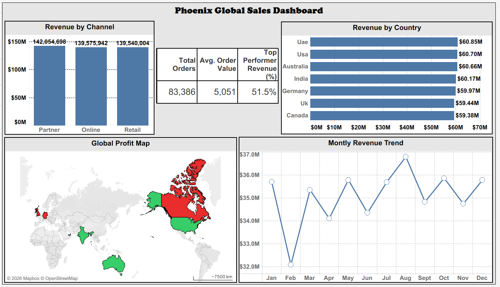
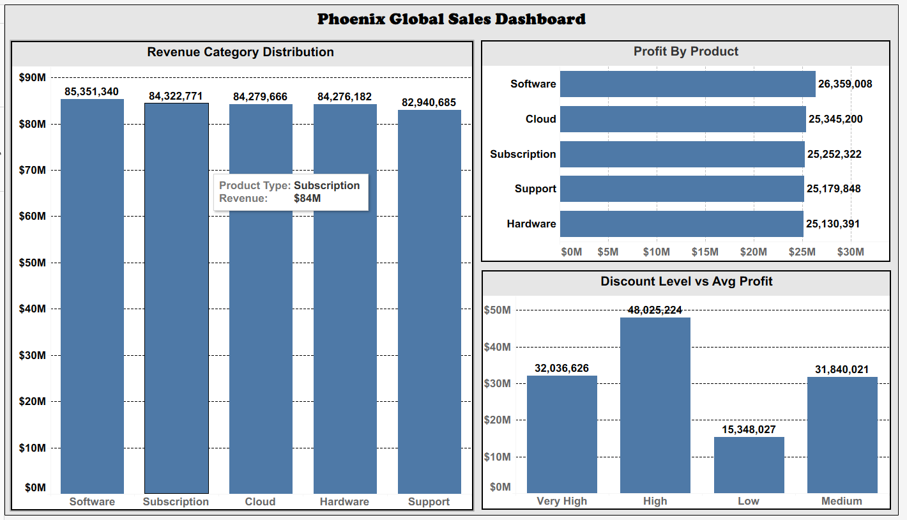
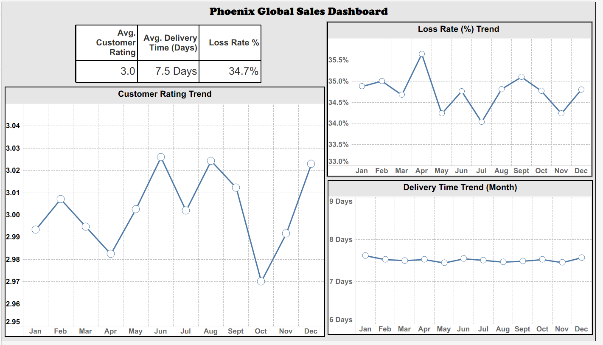

# Phoenix Global Sales Analysis

### Company Name: Phoenix Electronic and Service Pvt Ltd

### Tableau Public Dashboard Link:-
https://public.tableau.com/views/PhoenixGlobalSalesDashboard/PhoenixGlobalSalesAnalysisBusinessStory?:language=en-US&:sid=&:redirect=auth&:display_count=n&:origin=viz_share_link

-----

### Project Summary:-
This End-to-End Data Analytics Project focuses on analyzing multi-year global sales performance for Phoenix Electronic and Service Pvt Ltd.

The objective is to:
- Understand Revenue and Profit Trends.
- Evaluate Geographical and Product Performance.
- Monitor Operational Efficiency.
- Track Customer Experience Metrics.
- Deliver Actionable Business Insights using **Python and Tableau**.

➤ The project follows a complete analytics workflow from raw data to interactive dashboards.

-----

### Dataset Description (After Cleaning):-
The cleaned dataset represents multi-year global sales transactions across multiple countries and business segments.

Key Highlights:
- Total Rows: ~500,000
- Time Period: Multiple Years (2019–2024)
- Coverage: Multiple countries across global regions.
- Data Type: Sales, Profit, Operations, and Customer Metrics.

➤ The dataset was **Cleaned, Processed, Standardized, and Optimized for analysis and visualization**.

-----

### Columns Name (Processed Data):-
1. Date
2. Year
3. Country
4. Region
5. Product_Type
6. Sales_Channel
7. Customer_Type
8. Units_Sold
9. Revenue
10. Cost
11. Profit
12. Discount_%
13. Customer_Rating
14. Delivery_Days
15. Order_ID
16. Phoenix_Branch_ID
17. Stock_Available
18. Profit_Margin_%
19. Revenue_Category
20. Profit_Category
21. High_Performance_Sale
22. Delivery_Performance
23. Discount_Level
24. Branch_Total_Units
25. Customer_Value

-----

### Tools and Techniques Used:-
1. Programming & Analysis:
- Python (Pandas, NumPy, etc)
- Jupyter Notebook.

2. Visualization:
- Tableau Public

3. Techniques:
- Data Cleaning & Preprocessing.
- Feature Engineering.
- Exploratory Data Analysis (EDA).
- KPI Calculation.
- Dashboard Development.
- Business Insight Generation.

-----

### Business Objectives:- 
1. Analyze overall revenue growth over multiple years.
2. Identify top-performing countries by revenue.
3. Evaluate product-wise profitability.
4. Measure profit margin trends.
5. Monitor operational loss rates.
6. Track delivery performance.
7. Analyze customer satisfaction trends.
8. Compare revenue across sales channels.
9. Assess impact of discounts on profit.
10. Identify high-performing regions.
11. Monitor monthly and yearly revenue patterns.
12. Analyze profit contribution by product category.
13. Understand revenue distribution across categories.
14. Track operational efficiency over time.
15. Identify seasonal sales trends.
16. Evaluate customer experience metrics.
17. Measure order value trends.
18. Compare regional performance.
19. Identify business risk areas.
20. Support strategic decision-making.

-----

### KPIs Calculated:-
- Total Revenue
- Total Profit
- Profit Margin %
- Total Units Sold
- Total Orders
- Average Order Value
- High Performer Sales %
- Average Delivery Time (Days)
- Average Customer Rating
- Loss Rate %

-----

### Key Analytical Insights:-
- Revenue shows consistent growth across multiple years.
- **UAE and USA** are top revenue-contributing countries.
- **Software products** generate the highest profit.
- High discount levels significantly reduce average profit.
- **Average delivery time remains stable around 7.5 days**.
- Customer ratings remain consistent around **3.0**.
- Loss rate remains relatively high **~34%**, indicating operational improvement opportunities.
- Sales channels contribute almost equally to revenue.

-----

### Dashboard Preview:-

-----

### Key Learnings:-
- Hands-on experience with large datasets of **500K+ rows**.
- Practical data cleaning and transformation skills.
- KPI development for business reporting.
- Interactive dashboard design using Tableau.
- Business storytelling using data.
- End-to-end project structuring on GitHub.

-----

### Project Structure:-

Phoenix_Global_Sales_Analysis
- Analysis_Using_Python/: Python Notebook.
- Dashboard/: "Phoenix_Global_Sales_Dashboard.twbx" file.
- Data/: Raw, Clean and Processed Dataset.
- Insights/: Business Insights & Recommendations.
- README.md: Project Documentation.

-----

### Key Outcome:-
- Delivered a complete business intelligence solution.
- Identified high-performing markets and products.
- Highlighted operational inefficiencies.
- Provided data-driven insights for strategic improvement.
- Built professional dashboards for stakeholder reporting.

-----

### Author:-
Yash Sonar
BBA Student | Aspiring Data Analyst

-----
